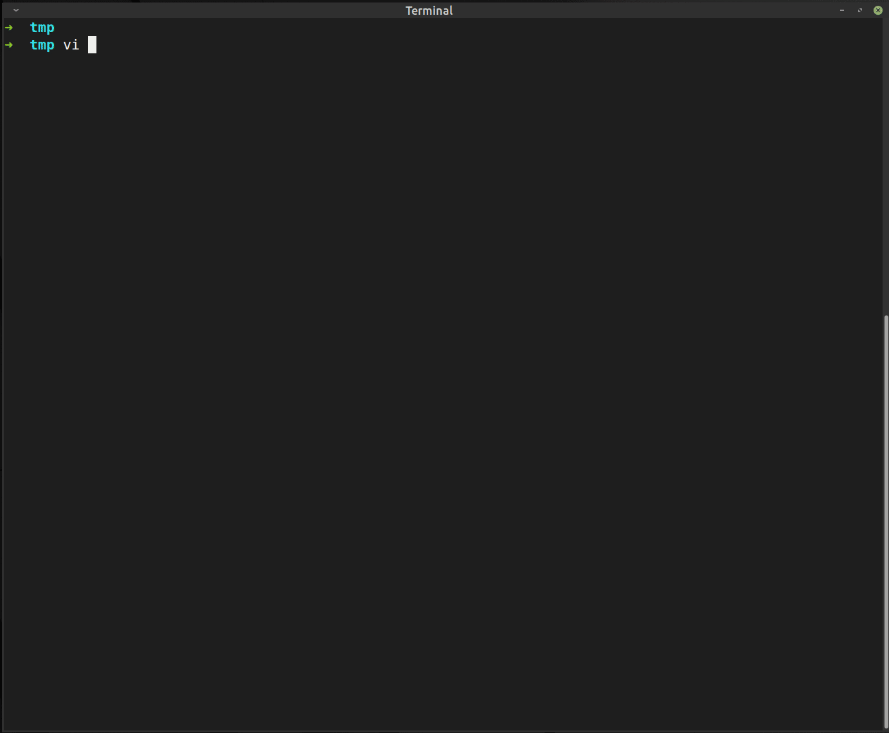

termdebug.nvim
==============
Copy termdebug.vim but with more features:

[](#features)
GIF record by [Peek](https://github.com/phw/peek)

Features:
- [x] enable customer define key-map
- breakpoints
  - [x] auto breakpoints save/restore base on function
  - [x] add enable/disable breakpoints
  - [x] push breakpoints to a floatterm
- [x] push backtrace to floatterm
- [x] add auto mode to: vertical, horizon
- [ ] output to floaterm

Why I copy/change termdebug.nvim:
- open to use, easy add customize keymap,
- quick, some gdb front-end using python api slow down the program,
- have gdb interact cmd shell, can't find it in `vimspector`
  - customize pretty-print

## QuickStart (default map)
```sh
1. edit a *.c file by neovim:

	$ nvim t1.c
	$ gcc -g -O0 -o t1 t1.c

2. Press <F2>, or execute command

	:Termdebug t1

3. The gdb frontend start:
4. Press <C-u>		# Open/Toggle backtrace/breakpoints view
   Press multiple times: toggle iter between views
5. Press <a-.>		# Focus breakpoints
6. Press <a-,>		# Focus backtrace
```

## PreRequire

- only work under linux(perl/gawk/echo) + neovim(ipc by `nvr`)
- require [nvr](https://github.com/mhinz/neovim-remote) to support floaterm ipc with main-gdb-window
```sh
	$ pip3 install --user neovim-remote
```
- require vim plugin [vim-floaterm](https://github.com/voldikss/vim-floaterm) to support backtrace/breakpoints float windows
```vim
	" vim-plug
	Plug 'voldikss/vim-floaterm'
	""if use dein.nvim
	"call dein#add('voldikss/vim-floaterm')
```
- remote plugin (python implement file monitor):
```vim
	:PlugInstall
	:UpdateRemotePlugins
```
## Keymap: [default]

Keymap [Enable]/disable:  g:termdebugMap
```vim
	let g:termdebugMap = 0
	let g:termdebug_wide = 2
	"GDB-window mode:  g:termdebug_wide
	" 0   horizon
	" 1   vertical
	"[2]  auto
```

# Command & Keymap

| Mapping          | Command                              | Description                                                          |
|------------------|--------------------------------------|----------------------------------------------------------------------|
| &lt;F4&gt;       | `:Continue`                          | Continue execution (`continue` in gdb)                               |
| &lt;F5&gt;       | `:Over`                              | Step over the next statement (`next` in gdb)                         |
| &lt;F6&gt;       | `:Step`                              | Step into the next statement (`step` in gdb)                         |
| &lt;F7&gt;       | `:Skip`                              | Step out the current frame (`finish` in gdb)                         |
| &lt;F8&gt;       | `:Eval`                              | Eval current variable's value (`print var` in gdb)                   |
| &lt;F9&gt;       | `:GdbUntil`                          | Toggle breakpoint in the coursor line                                |
| &lt;a-p&gt;      | `:call TermDebugSendCommand("up")`   | Navigate one frame up (`up` in gdb)                                  |
| &lt;a-n&gt;      | `:call TermDebugSendCommand("down")` | Navigate one frame down (`down` in gdb)                              |

```vim
" The default config:
g:termdebugMapRefresh           :call TermDebugSendCommand("info local")
g:termdebugMapContinue          :Continue
g:termdebugMapNext              :Over
g:termdebugMapStep              :Step
g:termdebugMapSkip              :Skip
g:termdebugMapFinish            :Finish
g:termdebugMapUntil             :GdbUntil
g:termdebugMapDebugStop         :Stop

g:termdebugMapToggleBreak       :Break
g:termdebugMapRemoveBreak       :Clear
g:termdebugMapToggleBreakAll    :ToggleAll
g:termdebugMapClearBreak        :ClearAll

g:termdebugMapFrameUp           :call TermDebugSendCommand("up")
g:termdebugMapFrameDown         :call TermDebugSendCommand("down")

g:termdebugMapViewToggle        :call TermDebugView("all")
g:termdebugMapViewBpoint        :call TermDebugView("tbpoint")
g:termdebugMapViewBtrace        :call TermDebugView("tbtrace")
```

## Develop

### GDB /MI interface

	$ gdb --interpreter=mi2 a.out

